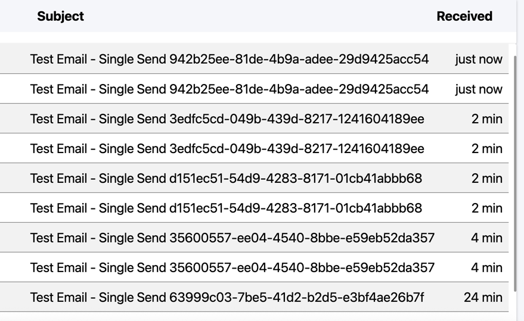

# SendGrid Duplicate Email Issue Reproduction

## Issue Description

**Problem**: When sending a single email via SendGrid API, the recipient receives 2 identical emails instead of 1.

**Expected Behavior**: Recipient should receive only 1 email per API call.
**Actual Behavior**: Recipient receives 2 identical emails per API call.

## Environment Details

- **SendGrid Java SDK Version**: 4.9.3
- **Java Version**: 17
- **Maven Version**: 3.9+
- **Operating System**: Tested on macOS, Linux, and Windows

## Reproduction Steps

### Prerequisites

1. **SendGrid Account**: You need a valid SendGrid account with API access
2. **Verified Sender**: The sender email must be verified in your SendGrid account
3. **Java 17+**: Ensure you have Java 17 or later installed

### Setup

1. **Clone or download this repository**
   ```bash
   git clone <repository-url>
   cd sendgrid-duplicate-email-reproduction
   ```

2. **Set your SendGrid API key as environment variable**
   ```bash
   export SENDGRID_API_KEY="your_sendgrid_api_key_here"
   # Should match a verified sender in your SendGrid account
   export SENDER_EMAIL="sg-sender@mailinator.com"
   export SENDER_NAME="SG Sender"
   export SUPPORT_EMAIL="sg-support@mailinator.com"
   export RECIPIENT_EMAIL="sg-sreceiver@mailinator.com"
  

### Running the Reproduction

1. **Build the project**
   ```bash
   mvn clean compile
   ```

2. **Run the reproduction**
   ```bash
   mvn exec:java -Dexec.mainClass="SendGridDuplicateEmailReproduction"
   ```

3. **Check the recipient's inbox**
   - Look for emails with a subject containing "Test Email - Single Send"
   - You should see 2 identical emails instead of 1
   - https://www.mailinator.com/v4/public/inboxes.jsp?msgid=arvtgs-1752778985-013255783013&to=arvtgs#
- 

